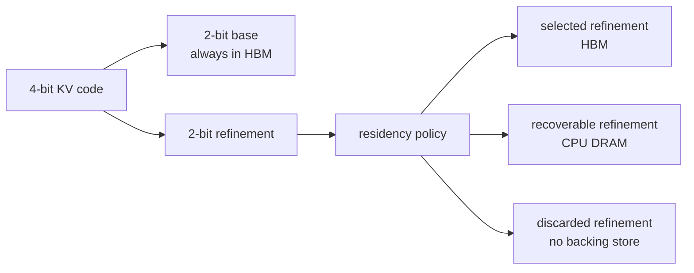

# Paged Precision

Paged Precision is a runtime-selective mixed-precision construction for
TurboQuant-MSE KV caches. It splits each 4-bit code into a permanent 2-bit base
and an exact 2-bit refinement. The base always remains in GPU high-bandwidth
memory (HBM). A refinement can stay in HBM, remain recoverable in CPU DRAM, or
be deleted.

This repository is the research artifact for an MSc dissertation. It contains
the implementation, fixed experiment definition, complete window-level results,
tests, citation metadata, and reproducibility commands. It is not a production
serving library.



## Results

The main comparisons use direct TQ3-MSE as the reference and pair the same 30
windows for each model:

- **10% recent:** uses 25.2% less HBM. Perplexity is 1.4% higher on Mistral and
  0.4% lower on Llama. It is DRAM-free.
- **25% attention EMA:** uses 15.8% less HBM and lowers perplexity by 0.7% on
  Mistral and 3.4% on Llama.
- **50% attention EMA:** uses the same reported HBM budget and lowers
  perplexity by 1.5% on Mistral and 3.7% on Llama.

Perplexity percentages are calculated as
`100 * (exp(mean paired NLL difference) - 1)`. The complete evidence is in
[`results/experiment.csv`](results/experiment.csv), which contains all 840
window-level rows. Lower perplexity is better.

## Experiment

The repository contains one experiment. It measures continuation perplexity
and persistent KV-cache memory on the WikiText-103 test split.

| Setting | Value |
|---|---|
| Models | Mistral-7B-Instruct-v0.3, Llama-3.1-8B-Instruct |
| Window | 8,192 context tokens and 256 scored tokens |
| Samples | 30 non-overlapping windows per model |
| Hardware | NVIDIA B200 |
| Representation | 2-bit base and 2-bit refinement |
| Refinement HBM | 0%, 10%, 25%, 50%, 100% |
| Policies | sink, recent, attention EMA |
| References | Direct TQ2-MSE, TQ3-MSE, TQ4-MSE, and BF16 KV |
| Seed | 7 |

Attention EMA keeps recoverable CPU refinements because an old block may become
important again. Recent and sink are monotone, so they delete refinements that
will not return to HBM and require no cold DRAM.

The policies are compared only at 10%, 25%, and 50%. The 0% and 100% endpoints
do not depend on a policy. Together with the four direct references, this gives
14 arms and 840 rows. The complete fixed definition is in
[`experiment.yaml`](experiment.yaml).

## Reproduce

### Prerequisites

- Python 3.11 and [`uv`](https://docs.astral.sh/uv/)
- A configured [Modal](https://modal.com/) account with B200 access
- A Hugging Face account with access to Llama 3.1 and an `HF_TOKEN` in the
  environment

The locked local environment uses PyTorch 2.12.1 for CPU checks and
orchestration. GPU evaluation runs in the pinned Modal image defined in
[`scripts/run_full_b200.py`](scripts/run_full_b200.py): Python 3.11, PyTorch
2.7.1, CUDA 12.8, Transformers 4.50.0, and an NVIDIA B200.

### Inspect and test locally

No GPU is required to inspect the committed results or run the local checks.

```bash
uv sync --locked --extra dev
uv run --locked pytest -q
uv run --locked ruff check .
uv run --locked paged-precision --dry-run
```

The dry run prints the complete 840-row experiment matrix without launching
Modal.

### Run the complete B200 suite

Authenticate once, set `HF_TOKEN`, and choose a new lowercase run identifier for
each launch:

```bash
uv run --locked modal setup
uv run --locked paged-precision-full --run-id my-run-20260819
```

The full command launches detached across 10 B200 workers. It creates fresh
`paged-precision-my-run-20260819-cache` and
`paged-precision-my-run-20260819-results` Modal volumes, and refuses to use a
non-empty volume. The command prints the supervisor call ID and dashboard URL.
The result volume retains the manifest, call identifiers, progress records,
status records, and final CSV.

Download the complete run record without replacing the committed results:

```bash
uv run --locked modal volume get paged-precision-my-run-20260819-results / output/runs/my-run-20260819
```

The final CSV will be at `output/runs/my-run-20260819/experiment.csv` after the
run completes. The `output/` directory is ignored by Git.

The shorter foreground runner is also available:

```bash
uv run --locked paged-precision
```

This command waits for one remote call per model and then replaces the tracked
`results/experiment.csv` atomically. Run it only when replacing that evidence is
intentional.

## Scope

The reported experiment measures continuation perplexity and persistent HBM and
DRAM allocation for two similarly sized model families. It does not measure
decode latency, throughput, transfer traffic, retrieval accuracy, energy use,
or comparison with an independently implemented mixed-precision KV-cache
system. These are evaluation boundaries, not claims made by the artifact.

## Repository guide

| Path | Contents |
|---|---|
| [`experiment.yaml`](experiment.yaml) | Fixed experiment matrix and seed |
| [`results/experiment.csv`](results/experiment.csv) | All 840 result rows |
| [`src/paged_precision/`](src/paged_precision/) | Quantizer, cache, policies, runtime, and runners |
| [`tests/`](tests/) | Correctness and experiment-shape tests |
| [`scripts/run_full_b200.py`](scripts/run_full_b200.py) | Detached 10-worker B200 launcher |
| [`main.py`](main.py) | Minimal command-line entry point |
| [`pyproject.toml`](pyproject.toml) and [`uv.lock`](uv.lock) | Package metadata and locked local environment |

## Citation and licence

Use [`CITATION.cff`](CITATION.cff) to cite the software and accompanying
dissertation. GitHub exposes it through the repository's **Cite this
repository** menu. The software is released under the
[`MIT License`](LICENSE). Questions and reproducibility reports can be opened
as [GitHub issues](https://github.com/sheikhuzairhussain/paged-precision/issues).
